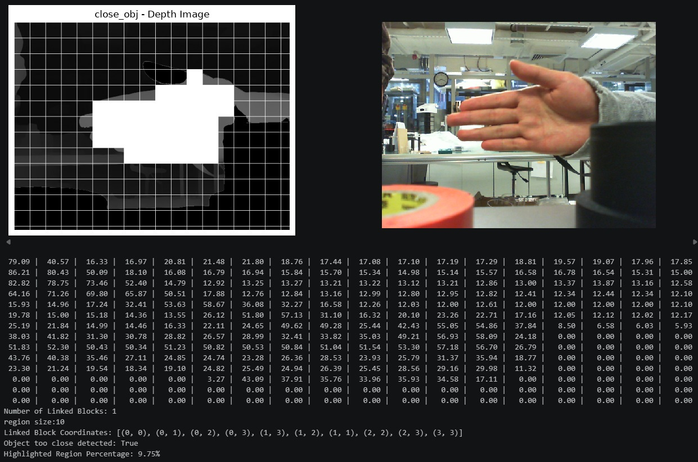

# Hi there, I'm Edwin 👋

Currently, I focus on the intersection of **ROS2 software architecture, computer vision, and DevOps for robotics**.

## My highlighted projects

### [Mantaray-on-IaC](https://github.com/zkinhang/Mantaray-on-IaC)
An experimental, **cloud-native robotics infrastructure** built to orchestrate and manage Remotely Operated Vehicles (ROVs). It leverages **Ansible** and **Kubernetes** to deploy scalable **ROS2** microservices directly onto robotic hardware.

### [ros2-astar-path-planning](https://github.com/zkinhang/ros2-astar-path-planning)
A custom **ROS2 package** implementing the A* path-planning algorithm, specifically engineered for autonomous underwater navigation at the **SAUVC 2025** competition.

### [depth-anything-detector](https://github.com/zkinhang/depth-anything-detector)
An underwater visual navigation module leveraging the **Depth-Anything** foundational model to provide real-time monocular depth estimation and perception for autonomous underwater vehicles (AUVs).

## 🤝 Connect With Me

* 💼 **LinkedIn:** [linkedin.com/in/kin-hang-zhang-7920a8293](https://www.linkedin.com/in/kin-hang-zhang-7920a8293)
* 📧 **Email:** `zkinhang714@gmail.com`
